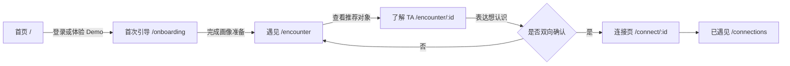

# 遇见 · 页面逻辑与用户流程

> 这份文档回答两个问题：用户第一次从哪里进入，以及每个导航入口分别解决什么任务。长期画像、此刻、侧面保持为三个独立模块，不在一个页面里堆叠。

## 一条主路径



- **第一次访问**：进入 `/`。完成知乎登录，或选择 Demo 体验后进入 `/onboarding`。
- **首次引导**：系统读取内容、生成基础画像；用户确认后点击“开始遇见”，进入 `/encounter`。
- **再次访问**：已有有效会话的用户从首页直接进入 `/encounter`，不重复做引导。
- **相遇主流程**：推荐卡片 → 了解 TA → 表达意向 → 双向确认后建立连接。

## 顶部导航的五个入口

| 导航 | 路径 | 用户要完成的任务 | 与其他页面的边界 |
| --- | --- | --- | --- |
| 个人 | `/profile` | 查看由长期公开表达生成的人物画像和证据 | 解释“长期以来我是谁”，不编辑当前心情或侧面 |
| 此刻 | `/me` | 记录今天的状态、社交意愿和偏好 | 解释“我现在怎么样”，是短周期、可随时更新的输入 |
| 侧面 | `/side` | 管理不同语境中的自己，选择一个侧面参与相遇 | 解释“我希望从哪一面被理解”，不是另一份长期画像 |
| 遇见 | `/encounter` | 查看候选人、了解 TA、表达认识意向 | 消费画像/此刻/侧面的结构化信号，不展示原始私密文字 |
| 关于遇见 | `/` | 理解产品价值并进入登录或 Demo | 只负责产品介绍和入口，不承载个人数据管理 |

## 三个自我模块如何配合

```text
个人 /profile：长期公开表达 → 稳定画像与证据
此刻 /me：今天的状态与期待 → 短期匹配信号
侧面 /side：选择当前希望被理解的语境 → 匹配上下文与展示权限
                         ↓
遇见 /encounter：只读取必要的结构化信号生成推荐与解释
```

这三个页面并列存在。用户可以只更新“此刻”而不改画像，也可以切换“侧面”而不改变长期画像。

## 侧面页内部流程

1. 进入 `/side`，先看到当前正在参与相遇的侧面。
2. 在“全部侧面”中选择另一项，右侧同步显示该侧面的推荐开关、可见时机和隐私说明。
3. 点击“设为当前侧面”，该侧面才会成为下一次相遇的上下文。
4. 点击“创建侧面”，填写名称和描述；新侧面默认仅自己可见，避免误公开。
5. 保存设置后，后续匹配只消费结构化摘要，不把原始记录直接展示给他人。

## 当前实现边界

- 首页登录、首次引导、相遇详情与双向连接已经有明确路由。
- `/profile`、`/me`、`/side` 已拆成独立页面，并使用同一组产品导航。
- `/side` 当前的选择、创建和权限设置是可交互的前端状态；刷新后的持久化仍需接入正式数据库接口。
- 知乎 OAuth 开放后只替换内容来源适配器，主页面流程不需要重做。

## 团队实现约束

- A 修改 `/me`，维护“此刻”的字段语义。
- C 修改相遇、匹配和连接流程，只消费冻结后的结构化契约。
- D 修改 `/profile`、`/side`、首页、引导和共享平台，并负责把跨页流程验收通过。
- 公共接口变化先更新 `docs/API_CONTRACTS.md`，再由业务页面跟进，避免多人同时改共享文件。
